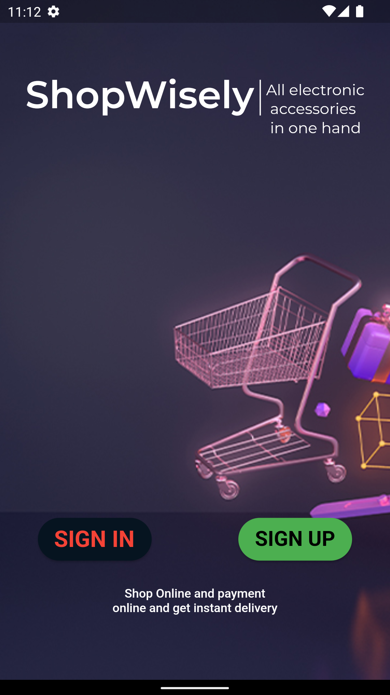

# ShopWisely
In this project i have made an Electronic Acessories application. I have used Node js as backend and dart for my frontend. Basically this is an e-commerce 
type website where people can buy all type of electronic acessories which make it easier for user.

# Following are the features of my project:
- Login and Registration
- Add to Cart
- Profile Update
- Animaion
- Attractive UI design.
- View Product Details
- About us page
- Search Project
- Hive as a local storage
- Share Preference

# Techonologies used
I have used Node js ans my backend because of its High-performance for Real-time Applications and it is easy to learn can can be implemented easily.The main reason of 
using Node js as my backend is Improves App Response Time and Boosts Performance. I have used flutter as my fronted to build application because Reduced Code Development 
Time and Faster code writing we can instantly hot relod the code we dont have to wait a long time to compile and run and it is a Simple platform and easy to use.I have use
Hive as my local storage since Hive is a quick, lightweight, NoSQL database for flutter and dart applications. I have alo used Shared preference since Shared Preferences is 
the way in which one can store and retrieve small amounts of primitive data as key/value pairs to a file on the device storage such as String, int, float, Boolean that make 
up your preferences in an XML file inside the app on the device storage

# Project challanges 
I faced many challanges during this project i faced a problem using shared preference in my project to store the token value. I also faced problem implementing the
hive as a local storage in my project. I also faced problem in sensor since the tablet doesnot support proxymity sensor,so i have make a video in my phone.

# Future Work
- To improve the security the security of the application.
- To make an attractive UI page 
- To provide the chat facilitiies in the application for user,so they can get information eeasily.
- To add an Bio-metric system while login in the application

# Repository Pattern 
I have followed repository pattern to complete my project.Repository pattern separates the data access logic and maps it to the business entities in the business logic
Communication between the data access logic and the business logic is done through interfaces.Simply, Repository pattern is a kind of container where data access logic is
stored. It hides the details of data access logic from business logic.

# State Management
I have used Get X to manage my state.since, i have used get x to add my product to favourite and add my product to cart. i have also used get x to navigate to other page
sice it is easier to to navigate using get x. Simply Get X ships out of the box with high-performance state management, intelligent dependency injection, and route management
in a simplistic and practical way.

# Appendix
  

# Conclusion
I have faced many problem making this project i have completed my project above are the screenshot of my project.By implementing above features
 I have made this app which will help the user to find all the electronic accessories in one application which would save time and money for the user. 
 It reduces the amount of manpower necessary and provides precise data. I have use different animation and attractive UI design which will help the user 
 to use application easily. 

